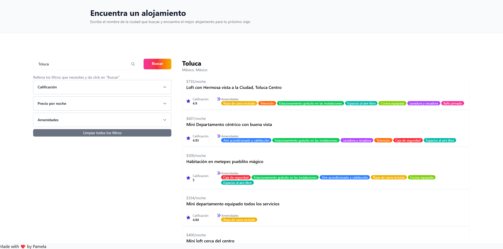
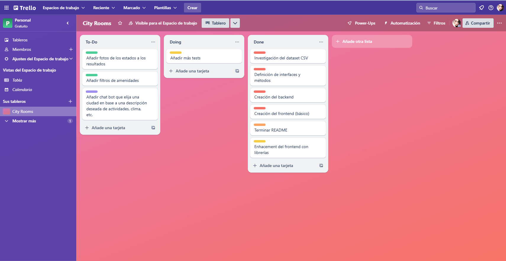

# City Rooms

## Descripción del Proyecto

**City Rooms** es una aplicación web que permite a los usuarios buscar y filtrar habitaciones disponibles en diferentes ciudades. La aplicación obtiene datos de Airbnb y proporciona una interfaz intuitiva para explorar opciones de alojamiento con diversos filtros como precio, calificación y amenidades.

### Vista Previa



## Estructura del Proyecto

```bash
city-rooms/
├── client/               # Frontend (React + Vite)
│   ├── src/
│   │   ├── components/   # Componentes React
│   │   ├── interfaces/   # Definiciones de tipos TypeScript
│   │   └── services/     # Servicios para llamadas API
│   └── package.json
├── server/               # Backend (Node.js + Express)
│   ├── data/             # Datos CSV
│   ├── interfaces/       # Interfaces compartidas
│   ├── repositories/     # Capa de acceso a datos
│   ├── routes/           # Rutas de la API
│   ├── services/         # Lógica de negocio
│   └── server.ts         # Punto de entrada del servidor
└── package.json          # Configuración principal del proyecto
```

## Instalación y Configuración

1. Clona el repositorio:

```bash
git clone https://github.com/epamela/city-rooms.git
cd city-rooms
```

2. Instala las dependencias:

```bash
npm install
npm run postinstall
```

Alternativamente, entrar a cada carpeta y ejecutar `npm install`.

3. Inicia la aplicación en modo de desarrollo:

```bash
npm run dev
```

La aplicación estará disponible en:

```bash
- Frontend: http://localhost:5173
- Backend: http://localhost:3000
```

## Proceso de desarrollo

1. Planteamiento del problema y definición de tareas. Definí las tareas y les asigné un orden de prioridad. Se puede ver en la siguiente imagen:



La prioridad se asignó basado en la dificultad de la tarea, y el tiempo que me tomaría hacerlo.

- Prioridad alta: los requerimientos del proyecto y lo necesario para que el proyecto funcione.
- Prioridad media: trabajo necesario e importante.
- Prioridad baja: trabajo que ayuda con la funcionalidad del proyecto y experiencia de usuario.
- "Nice to have" (morado): trabajo que no es necesario para el proyecto, pero añadiría valor al proyecto.

2. Entendimiento del dataset y definición de la forma en la que iba a trabajar. Para este caso, primero hice un análisis de los datos para verificar la calidad de los datos y ver si era necesario limpiarlos. En este caso, los datos eran bastante limpios, por lo que no fue necesario. Se puede ver el corto análisis en el archivo `utils/RoomsExploration.ipynb`.

3. Definición de el design pattern que iba a usar. En este caso, me decidí por el repositorio y el patrón de diseño de repositorio. Me decidí por un diseño de repositorios ya que me permite oportunidades de escalar fácilmente el proyecto, ya que un archivo CSV no es un formato óptimo y, mientras que permite usarlo para completar el proyecto, este diseño me permitirá escalar el proyecto a un futuro.

4. Generación de código.

5. Refactorización y testing.

## Uso de IA en el Desarrollo

1. Generación de código

   - Trabajo con la herramienta de Cursor que no sólo tiene sugerencias de autocompletar, sino que me permite generar archivos completos con la IA. Mi primer paso fue un prompt de "genera la estructura de repositorios para un proyecto full-stack que trabajará con dos interfaces, Room y Place. Room obtendrá datos de un archivo CSV y Place obtendrá datos desde una API. Se usará express para el servidor y Vite para el frontend, en ambas partes con typescript." Esto me permitió ahorrar tiempo en la creación de la estructura del proyecto, y sólo tuve que modificar algunas cosas para que el proyecto funcionara.

   - Un prompt similar fue usado para generar la estructura básica en React + Vite.

   - Generación de las interfaces. El autocompletamiento me generó las interfaces con los tipos correctos basados en ejemplos que tenía de los datos.

   - Autocompletar el código. Al escribir el código, la IA me sugería cómo continuar.

   - Generar tests. La IA me generó tests para los repositorios y servicios.

2. Documentación
   - Apoyo al redactar el READMI y generar la estructura del proyecto.

# Futuras mejoras

1. Mejorar la interfaz de usuario: los filtros no son muy intuitivos y no son muy fáciles de usar.

2. Mejorar la interfaz de usuario: añadir fotos de las ciudades para que sea más atractiva.

3. Añadir un repositorio para poder fácilmente traer datos de los cuartos de una base de datos y/o de una API.

4. Mejorar la responsividad de la aplicación.
